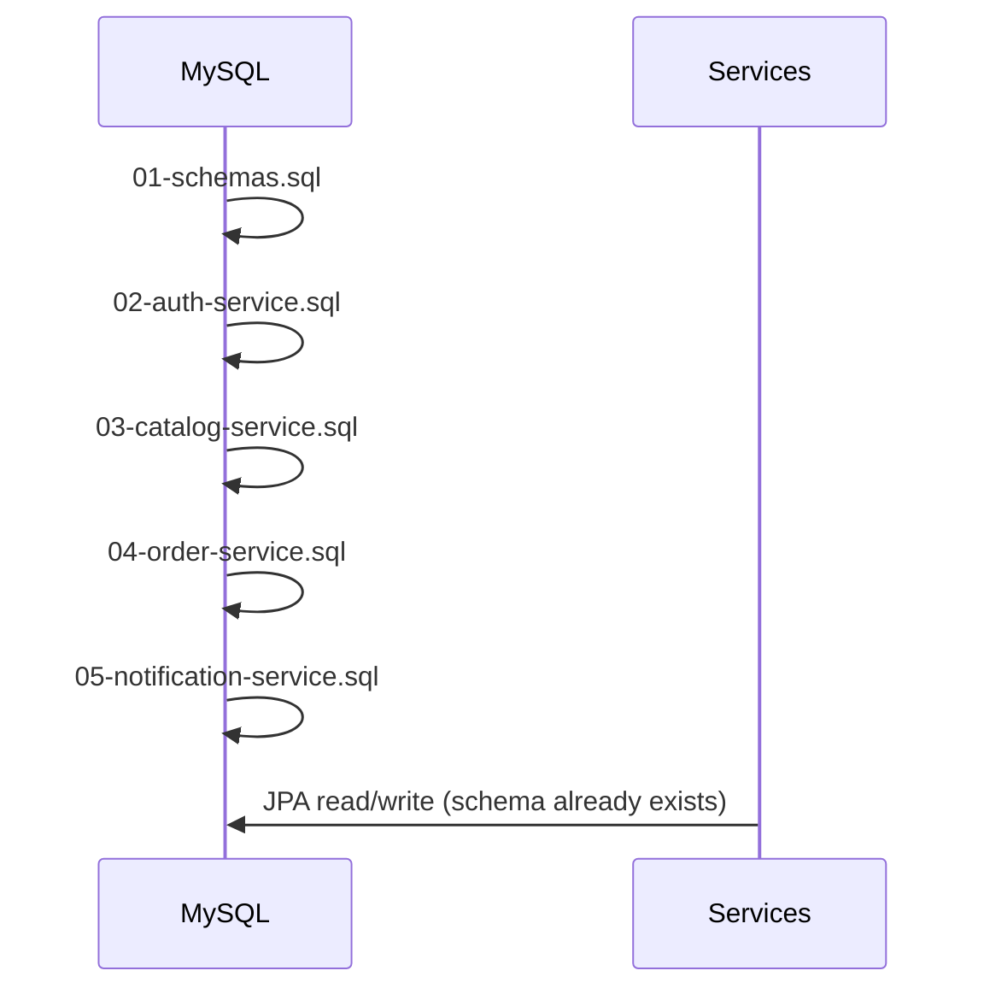

# SQL & Database Setup

PixelMart uses **one MySQL 8.4 instance** with **four service databases**. Schema DDL lives in **`pixelmart-setup/sql/`** — not in backend services.

## Policy: no DDL auto, no Flyway in services

Every backend service sets:

```yaml
spring.jpa.hibernate.ddl-auto: none
spring.flyway.enabled: false
```

| Layer | Responsibility |
|-------|----------------|
| `sql/01-schemas.sql` | Databases, grants |
| `sql/02–05-*-service.sql` | Tables, indexes, seed data (one file per service) |
| JPA/Hibernate | Read/write data only — **never** auto-create or alter schema |

Integration tests use H2 with `ddl-auto: create-drop` in `application-test.yml` only. That profile is **not** active in Docker or production.

## Architecture

```
MySQL 8.4
├── pixelmart-db   (bootstrap marker DB from Compose MYSQL_DATABASE)
├── auth           ← auth-service
├── catalog        ← catalog-service
├── orders         ← order-service
└── notify         ← notification-service
```

Each service connects to its database via JDBC URL, for example:

```
jdbc:mysql://localhost:3306/auth?...
jdbc:mysql://localhost:3306/catalog?...
jdbc:mysql://localhost:3306/orders?...
jdbc:mysql://localhost:3306/notify?...
```

## SQL files (`sql/`)

| File | Database | Contents |
|------|----------|----------|
| [`01-schemas.sql`](sql/01-schemas.sql) | — | Creates `pixelmart-db`, `auth`, `catalog`, `orders`, `notify`, grants |
| [`02-auth-service.sql`](sql/02-auth-service.sql) | `auth` | Users, roles, refresh tokens, demo accounts |
| [`03-catalog-service.sql`](sql/03-catalog-service.sql) | `catalog` | Catalog, offers, wishlist, reviews, demo seed |
| [`04-order-service.sql`](sql/04-order-service.sql) | `orders` | Carts, addresses, orders, payments, idempotency |
| [`05-notification-service.sql`](sql/05-notification-service.sql) | `notify` | Email outbox |

Scripts run in **alphabetical order** on first MySQL init via Docker `docker-entrypoint-initdb.d`.

### Demo accounts (auth seed)

| Role | Email | Password |
|------|-------|----------|
| Admin | `admin@pixelmart.local` | `Admin@123` |
| Customer | `customer@pixelmart.local` | `Customer@123` |

## Docker (automatic)

On **first** MySQL container start with an empty volume, Compose mounts:

```
sql/ → /docker-entrypoint-initdb.d/
```

**Important:** Init scripts run only when the MySQL data volume is new. To re-bootstrap:

```bash
docker compose down -v
docker compose up --build
```

## Manual (local MySQL or cloud RDS)

Run all scripts in order:

```bash
mysql -h localhost -P 3306 -u root -p < sql/01-schemas.sql
mysql -h localhost -P 3306 -u root -p < sql/02-auth-service.sql
mysql -h localhost -P 3306 -u root -p < sql/03-catalog-service.sql
mysql -h localhost -P 3306 -u root -p < sql/04-order-service.sql
mysql -h localhost -P 3306 -u root -p < sql/05-notification-service.sql
```

Environment variables (`.env`):

| Variable | Default | Used by |
|----------|---------|---------|
| `MYSQL_HOST` | `localhost` (Compose: `mysql`) | All services |
| `MYSQL_PORT` | `3306` | All services |
| `MYSQL_DATABASE` | `pixelmart-db` | MySQL container bootstrap |
| `MYSQL_USER` | `root` | All services |
| `MYSQL_PASSWORD` | `root` | All services |
| `MYSQL_ROOT_PASSWORD` | `root` | MySQL container |

Compose exposes MySQL on host port **3307** → container `3306`.

## Startup order



Docker Compose waits for MySQL health before starting services.

## Verify schema

```bash
docker exec -it pixelmart-mysql mysql -u root -proot -e "SHOW DATABASES;"
docker exec -it pixelmart-mysql mysql -u root -proot -e "USE auth; SHOW TABLES;"
docker exec -it pixelmart-mysql mysql -u root -proot -e "SELECT email FROM auth.users;"
```

## Schema changes

1. Edit the **single** SQL file for that service under `sql/` (e.g. `03-catalog-service.sql`).
2. For existing dev DBs: `docker compose down -v` and bring the stack back up, or apply the changed DDL manually.
3. Do **not** add `db/migration` folders back into backend services.

## Do not use

| Setting | Why |
|---------|-----|
| `ddl-auto: update` | Unversioned schema drift |
| `ddl-auto: create` / `create-drop` | Wipes or recreates tables; not for shared MySQL |
| Flyway in services | Duplicates setup SQL; use `pixelmart-setup/sql/` only |

## Reset database (development)

```bash
docker compose down -v
docker compose up --build
```

This drops the `mysql_data` volume and re-runs all SQL init scripts.
