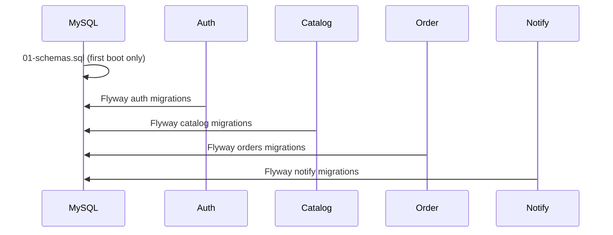

# SQL & Database Setup

PixelMart uses **one MySQL 8.4 instance** with **four logical schemas**. Application tables are created by **Flyway**, not Hibernate DDL auto.

## Policy: no DDL auto

Every backend service sets:

```yaml
spring.jpa.hibernate.ddl-auto: none
spring.flyway.enabled: true
```

| Layer | Responsibility |
|-------|----------------|
| Bootstrap SQL | Databases, schemas, user grants |
| Flyway | Tables, indexes, seed data (versioned migrations) |
| JPA/Hibernate | Read/write data only — **never** auto-create or alter schema |

Integration tests use H2 with `ddl-auto: create-drop` in `application-test.yml` only. That profile is **not** active in Docker or production.

## Architecture

```
MySQL 8.4 (database: pixelmart)
├── auth          ← auth-service
├── catalog       ← catalog-service
├── orders        ← order-service
└── notify        ← notification-service
```

Each service connects to its schema via JDBC URL, for example:

```
jdbc:mysql://localhost:3306/auth?...
jdbc:mysql://localhost:3306/catalog?...
jdbc:mysql://localhost:3306/orders?...
jdbc:mysql://localhost:3306/notify?...
```

## Step 1 — Bootstrap (schemas & grants)

### Docker (automatic)

On **first** MySQL container start with an empty volume, Compose mounts:

```
sql/ → /docker-entrypoint-initdb.d/
```

Script executed: [`sql/01-schemas.sql`](sql/01-schemas.sql)

It creates:

- Database `pixelmart`
- Schemas `auth`, `catalog`, `orders`, `notify`
- Grants for user `pixelmart` (from `.env`)

**Important:** Init scripts run only when the MySQL data volume is new. To re-bootstrap:

```bash
docker compose down -v
docker compose up --build
```

### Manual (local MySQL or cloud RDS)

1. Create a MySQL 8.x user (or use root for dev only).
2. Run the bootstrap script as a user with `CREATE` privilege:

```bash
mysql -h localhost -P 3306 -u root -p < sql/01-schemas.sql
```

3. Ensure `.env` / service env vars match your host, port, user, and password:

| Variable | Default | Used by |
|----------|---------|---------|
| `MYSQL_HOST` | `localhost` (Compose: `mysql`) | All services |
| `MYSQL_PORT` | `3306` | All services |
| `MYSQL_USER` | `pixelmart` | All services |
| `MYSQL_PASSWORD` | `pixelmart` | All services |

Compose exposes MySQL on host port **3307** → container `3306`.

## Step 2 — Flyway migrations (tables & data)

Migrations run **automatically** when each Spring Boot service starts. Flyway creates a `flyway_schema_history` table per schema.

### auth-service → schema `auth`

| Migration | Type | Description |
|-----------|------|-------------|
| V1__init.sql | SQL | Schema bootstrap marker |
| V2__users_and_roles.sql | SQL | Users, roles |
| V4__refresh_tokens.sql | SQL | Refresh token storage |
| V3__Seed_test_users.java | Java | Demo admin + customer accounts |

Path: `pixelmart-backend/auth-service/src/main/resources/db/migration/` (+ Java migration in `src/main/java/db/migration/`)

### catalog-service → schema `catalog`

| Migration | Description |
|-----------|-------------|
| V1__init.sql | Bootstrap marker |
| V2__categories_and_products.sql | Categories, products |
| V3__seed_catalog.sql | Base catalog seed |
| V4__store_settings_images_audit.sql | Settings, images, audit |
| V5__offers.sql | Offers / coupons |
| V6__wishlist_items.sql | Wishlist |
| V7__reviews.sql | Reviews |
| V8__fix_review_id_columns.sql | Review ID fix |
| V9__demo_seed.sql | Demo products, offers, reviews |

Path: `pixelmart-backend/catalog-service/src/main/resources/db/migration/`

### order-service → schema `orders`

| Migration | Description |
|-----------|-------------|
| V1__init.sql | Bootstrap marker |
| V2__carts_and_cart_items.sql | Cart |
| V3__addresses_and_pincode_cache.sql | Addresses, pincode cache |
| V4__orders_order_items_payments.sql | Orders, items, payments |
| V5__order_discount.sql | Order-level discounts |
| V6__checkout_idempotency.sql | Checkout idempotency keys |

Path: `pixelmart-backend/order-service/src/main/resources/db/migration/`

### notification-service → schema `notify`

| Migration | Description |
|-----------|-------------|
| V1__init.sql | Bootstrap marker |
| V2__email_outbox.sql | Email outbox |

Path: `pixelmart-backend/notification-service/src/main/resources/db/migration/`

## Startup order



Docker Compose waits for MySQL health before starting services. Each service applies its own Flyway history independently.

## Verify schema

### Docker

```bash
docker exec -it pixelmart-mysql mysql -u pixelmart -ppixelmart -e "SHOW DATABASES;"
docker exec -it pixelmart-mysql mysql -u pixelmart -ppixelmart -e "USE auth; SHOW TABLES;"
docker exec -it pixelmart-mysql mysql -u pixelmart -ppixelmart -e "SELECT * FROM auth.flyway_schema_history;"
```

### Check Flyway from logs

```bash
docker compose logs auth-service | findstr /i flyway
```

Successful startup logs include Flyway migrate success for each service.

## Manual migration (without Docker)

1. Run [`sql/01-schemas.sql`](sql/01-schemas.sql).
2. Start services in any order (each runs Flyway on boot):

```bash
mvn -pl pixelmart-backend/auth-service spring-boot:run
mvn -pl pixelmart-backend/catalog-service spring-boot:run
# ... etc.
```

Or build and run JARs with `MYSQL_HOST`, `MYSQL_USER`, `MYSQL_PASSWORD` set.

## Do not use

| Setting | Why |
|---------|-----|
| `ddl-auto: update` | Unversioned schema drift; breaks multi-service ownership |
| `ddl-auto: create` / `create-drop` | Wipes or recreates tables; not for shared MySQL |
| Manual DDL in production | Bypasses Flyway history; causes migration conflicts |
| Editing applied migrations | Change checksums; use new `V{n+1}__*.sql` instead |

## Adding a new migration

1. Add `V{n}__description.sql` under the service's `src/main/resources/db/migration/`.
2. Never modify a migration already applied in shared environments.
3. Test with `mvn -pl pixelmart-backend/<service> verify`.
4. Deploy — Flyway runs the new script on next service start.

## Reset database (development)

```bash
docker compose down -v
docker compose up --build
```

This drops the `mysql_data` volume, re-runs bootstrap SQL, and re-applies all Flyway migrations.
